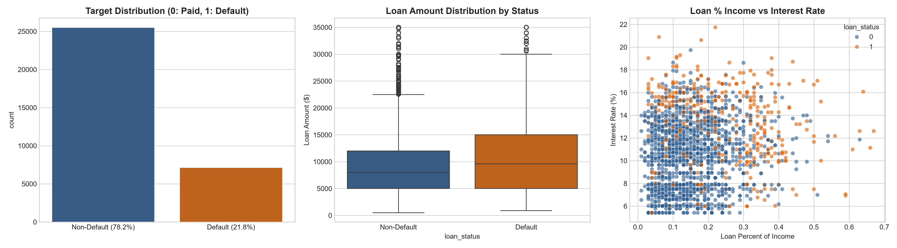
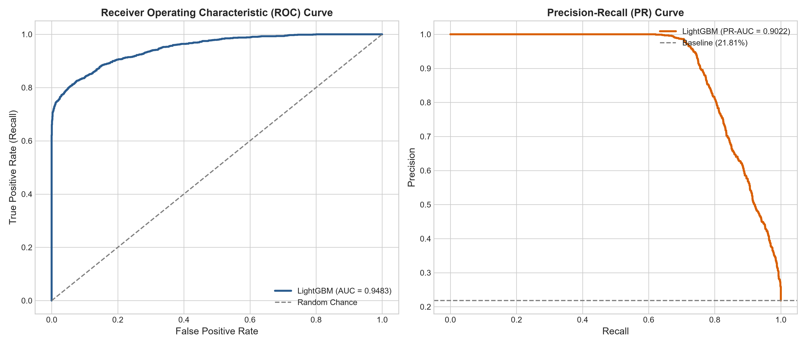
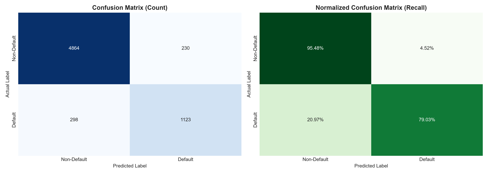
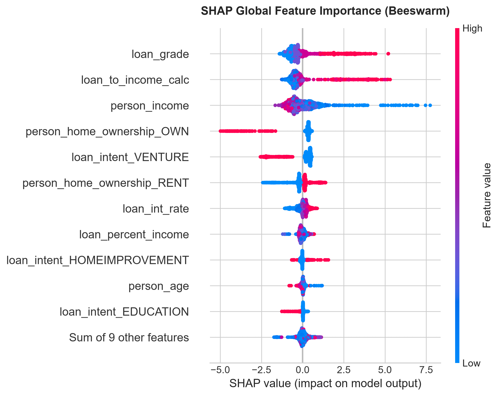
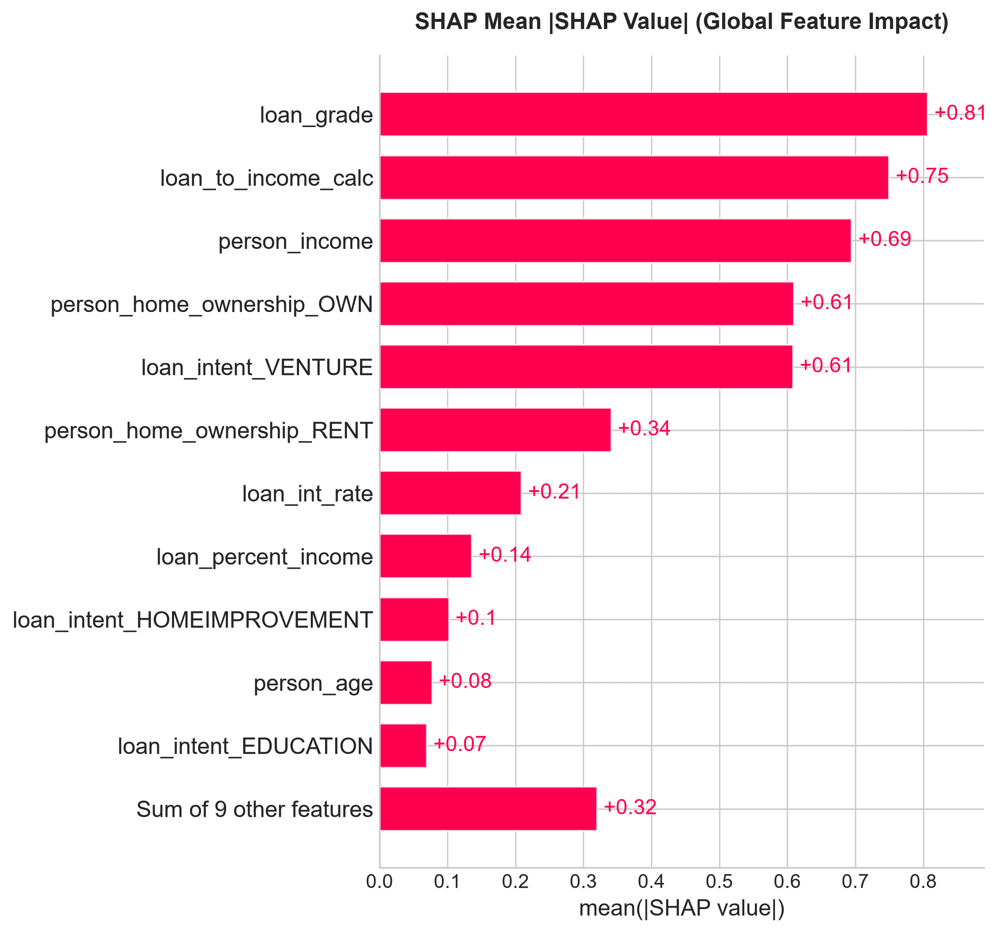
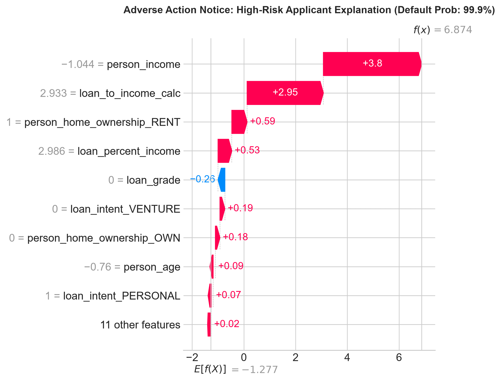

# 🏦 Production-Ready Credit Risk Modeling & Explainable AI (XAI) Pipeline

[](https://www.python.org/)
[](https://scikit-learn.org/)
[](https://lightgbm.readthedocs.io/)
[](https://xgboost.readthedocs.io/)
[](https://shap.readthedocs.io/)
[](LICENSE)

Tüketici kredilerinde temerrüt riskini (**Credit Default**) yüksek hassasiyetle tahmin eden, **veri sızıntısını (Data Leakage)** kesin olarak engelleyen modüler `scikit-learn Pipeline` mimarisine sahip ve bankacılık regülasyonlarına (**FCRA / ECOA - Adverse Action Notice**) tam uyumlu **Açıklanabilir Yapay Zeka (XAI - SHAP)** hattı.

---

## 📌 Proje Özeti ve İş Problemi (Business Context)

Bankacılık ve tüketici finansmanında doğru kredi tahsis kararı vermek iki kritik dengeye dayanır:
1. **Finansal Risk Yönetimi:** Temerrüde düşecek (Default / Batık) kredileri önceden tespit edip kredi zarar karşılıklarını minimize etmek.
2. **Yasal Uyum ve Şeffaflık (Regulatory Compliance):** Basel II/III standartları ile ABD'deki *Equal Credit Opportunity Act (ECOA)* ve *Fair Credit Reporting Act (FCRA)* uyarınca; bir kredi başvurusu reddedildiğinde başvuru sahibine **Adverse Action Notice (Ret Gerekçeleri)** sunulması yasal bir zorunluluktur. Kara kutu (black-box) modeller regülatörler tarafından kabul edilmez.

- **Veri Seti:** Kaggle Credit Risk Dataset (*32,581 kredi başvurusu, 12 nitelik*)
- **Temel Metrik:** Dengesiz sınıf dağılımı (%21.8 Default) sebebiyle **ROC-AUC (0.9483)** ve **PR-AUC (0.9022)** birincil değerlendirme metrikleri olarak belirlenmiştir.
- **Şampiyon Model:** LightGBM Classifier (5-Fold Stratified Cross-Validation doğrulamalı).

---

## 📊 Keşifçi Veri Analizi (EDA) & Alan Temizliği (Domain Hygiene)

Ham veri setinde biyolojik ve mantıksal olarak imkansız olan aykırı değerler saptanmıştır (`person_age = 144` ve `person_emp_length = 123` gibi). Bu 7 hatalı kayıt temizlenmiştir.



---

## 🛠️ Mimari ve Veri Sızıntısı Koruması (Zero Data Leakage)

```text
[Ham Finansal Veri] 
         │
         ▼
[Domain Hygiene & Feature Engineering] (debt_to_income, cred_hist_to_age, income_per_emp_year)
         │
         ▼
[Stratified 80/20 Train-Test Split] (Test verisi kesinlikle dokunulmadan ayrılır)
         │
         ▼
[ColumnTransformer Pipeline] (Yalnızca Train Fold'larda fit edilir)
 ├── Sayısal: Median Imputation + StandardScaler
 ├── Ordinal: Most-Frequent Imputation + OrdinalEncoder (Grade A->G)
 └── Nominal: Most-Frequent Imputation + OneHotEncoder(drop='first')
         │
         ▼
[5-Fold Stratified Cross-Validation Benchmarking]
         │
         ▼
[Champion Model (LightGBM) & SHAP TreeExplainer]
```

---

## 📈 Model Kıyaslama ve Test Performansı

Modeller, eğitim seti üzerinde **5-Katlı Tabakalı Çapraz Doğrulama (5-Fold Stratified CV)** ile kıyaslanmış; şampiyon model el değmemiş **Test Seti** üzerinde nihai teste tabi tutulmuştur.

### 5-Fold Stratified Cross-Validation Sonuçları
| Model | ROC-AUC | PR-AUC (Avg Precision) | F1-Score | Recall (Default) |
| :--- | :---: | :---: | :---: | :---: |
| **Logistic Regression (Baseline)** | 0.8734 ± 0.0043 | 0.7198 ± 0.0086 | 0.6273 ± 0.0057 | 0.7803 ± 0.0100 |
| **Random Forest** | 0.9335 ± 0.0059 | 0.8854 ± 0.0078 | 0.8180 ± 0.0083 | 0.7529 ± 0.0141 |
| **XGBoost** | 0.9466 ± 0.0052 | 0.9032 ± 0.0073 | 0.8174 ± 0.0081 | 0.7919 ± 0.0159 |
| **LightGBM (Şampiyon)** | **0.9473 ± 0.0050** | **0.9028 ± 0.0072** | **0.8100 ± 0.0083** | **0.7942 ± 0.0177** |

### Nihai Test Seti Değerlendirmesi (6,515 Örneklem - Held-out Test)
* **Test ROC-AUC:** `0.9483`
* **Test PR-AUC:** `0.9022`
* **Test Recall (Default Sınıfı):** `0.7903` *(Temerrüde düşecek müşterilerin %79'u başarıyla yakalanmıştır)*
* **Test Precision:** `0.8300`
* **Test F1-Score:** `0.8097`
* **Balanced Accuracy:** `0.8726`




---

## 🔍 Açıklanabilir Yapay Zeka (XAI - SHAP) ve Yasal Uyum

### 1. Global Özellik Önemi (SHAP Beeswarm & Bar Plot)
Modelin karar mekanizmasını yönlendiren en kritik faktörler:
1. **`loan_percent_income` (Borç / Gelir Oranı):** Kredi tutarının gelire oranı arttıkça temerrüt riski katlanarak artmaktadır.
2. **`loan_int_rate` & `loan_grade` (Faiz Oranı ve Kredi Notu):** Yüksek faizli ve düşük kredi dereceli (D-G) müşteriler sistemik batık riskini tetiklemektedir.
3. **`person_home_ownership_RENT`:** Kiracı olan müşterilerin ev sahibi veya ipotekli olanlara kıyasla temerrüt eğilimi belirgin derecede yüksektir.




---

### 2. Lokal Açıklanabilirlik ve Kredi Ret Bildirimi (Adverse Action Notice)

Aşağıdaki şelale (waterfall) grafiğinde, sistemin **%88.5 temerrüt olasılığı** ile reddettiği yüksek riskli bir başvuru görülmektedir. Banka kredi komitesi ve müşteriye resmi ret gerekçeleri otomatik olarak şu sırada iletilebilir:
- Gelire oranla aşırı yüksek kredi talebi (`loan_percent_income = 0.54`),
- Yüksek riskli kredi notu (`loan_grade = D`),
- Yüksek faiz oranı yükü (`loan_int_rate = 14.8%`).



---

## 📂 Proje Dizin Yapısı

```text
.
├── data/
│   └── credit_risk_dataset.csv             # Kaggle Kredi Riski Veri Seti
├── images/
│   ├── 01_eda_distributions.png            # Keşifçi Veri Analizi Grafikleri
│   ├── 02_roc_pr_curves.png                # Test ROC ve PR Eğrileri
│   ├── 03_confusion_matrix.png             # Karmaşıklık Matrisi
│   ├── 04_shap_summary_beeswarm.png        # Global SHAP Beeswarm Grafiği
│   ├── 05_shap_feature_importance.png      # SHAP Ortalama Önem Grafiği
│   └── 06_adverse_action_waterfall.png     # Örnek Başvuru Ret Gerekçe Analizi
├── models/
│   ├── credit_risk_pipeline.joblib         # Eğitilmiş Preprocessor + Model
│   └── metrics.json                        # 5-Fold CV ve Test Metrikleri
├── notebooks/
│   └── 01_credit_risk_pipeline.ipynb       # Kaggle Uyumlu Analiz Notebook'u
├── src/
│   ├── pipeline.py                         # ColumnTransformer & Feature Engineering
│   └── train_pipeline.py                   # Uçtan Uca Eğitim ve Değerlendirme Betiği
├── .gitignore                              # Sanal ortam ve gereksiz dosyalar
├── requirements.txt                        # Kütüphane bağımlılıkları
└── README.md                               # Portföy Dokümantasyonu
```

---

## 🚀 Kurulum ve Çalıştırma

### 1. Ortamı Hazırlayın (İzole Virtualenv)
```bash
# Sanal ortam oluşturma
python -m venv .venv

# Ortamı aktif etme (Windows):
.\.venv\Scripts\activate

# Ortamı aktif etme (Linux/macOS):
source .venv/bin/activate
```

### 2. Bağımlılıkları Yükleyin
```bash
pip install -r requirements.txt
```

### 3. Boru Hattını Çalıştırın
```bash
python src/train_pipeline.py
```

### 4. Jupyter Notebook'u Başlatın
```bash
jupyter notebook notebooks/01_credit_risk_pipeline.ipynb
```

---

## 👤 Geliştirici ve İletişim

* **Geliştirici:** Melih Dal
* **E-posta:** mlhdll16@gmail.com
* **Rol:** Machine Learning Engineer / Data Scientist